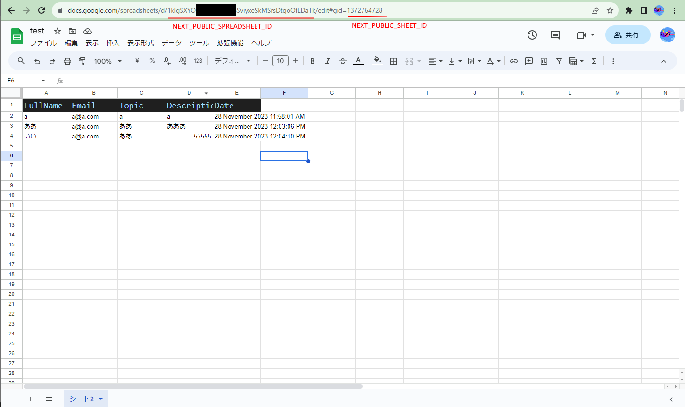

# Check out step guide

## node
```
$ node -v
v21.2.0
```

## npm
```
$ npm -v
10.2.3
```

## 参照ドキュメント
https://www.mridul.tech/blogs/save-form-data-in-google-sheets-with-next-js

https://github.com/Mridul2820/next-js-contact-from-google-sheet/

## git clone
```
$ git clone https://github.com/keisukearai3/spreadsheet.git
```

## deploy
```
$ cd spreadsheet
$ npm install
$ cp -pr .env.sample .env.local
```

## .env.local
4つの項目を設定
```
NEXT_PUBLIC_GOOGLE_CLIENT_EMAIL=googleサービスアカウントをダウンロードしたファイル中のclient_email
NEXT_PUBLIC_GOOGLE_CLIENT_PRIVATE_KEY=googleサービスアカウントをダウンロードしたファイル中のprivate_key
NEXT_PUBLIC_SPREADSHEET_ID=スプレッドシートのID
NEXT_PUBLIC_SHEET_ID=スプレッドシートのgid
```




## サーバ起動
```
$ npm run dev
```

## 画面で確認
http://localhost:3000/


send Messgaeボタン押下で、spread sheetに入力値が反映される